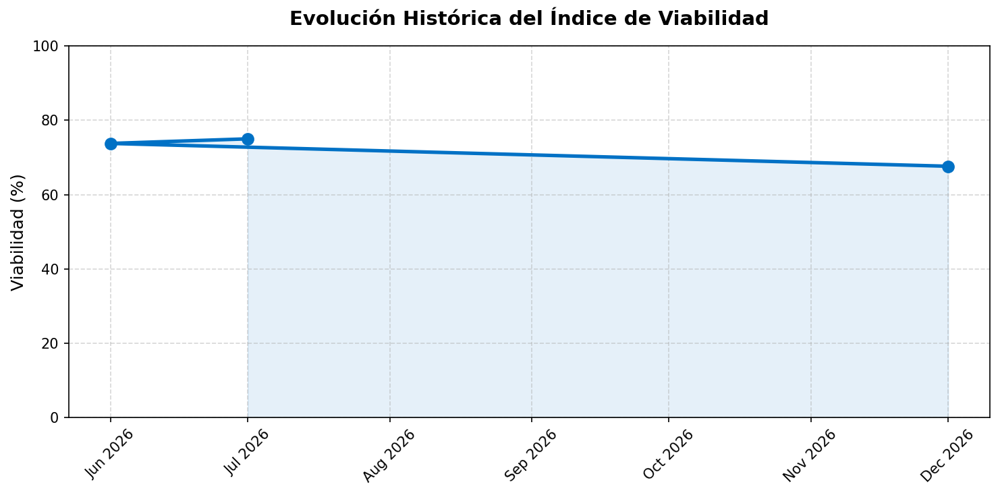

<div align="center">
  
  <h1>Augur: Índice de Viabilidad Presidencial</h1>
  <p><i>Sistema Cuantitativo Determinístico para la Proyección de Viabilidad de Reelección en Argentina</i></p>
  
  [](https://www.python.org/downloads/)
  [](LICENSE)
  [](https://github.com/lfmen/Augur/actions)
</div>

<br />

## Origen del Nombre

En la Antigua Roma, un **augur** era un sacerdote encargado de interpretar la voluntad de los dioses y predecir el futuro mediante el estudio del vuelo de las aves y otros signos naturales. 

En este proyecto, **Augur** funciona como una analogía moderna: en lugar de observar el cielo en busca de auspicios, el sistema procesa vectores de datos macroeconómicos y de opinión pública para proyectar matemáticamente, a través de la ciencia de datos, el nivel de viabilidad de reelección y la gobernabilidad actual.

---

## Estado Actual del Índice

<!-- PREDICTION_START -->
**Índice de Viabilidad de Reelección:** 73.8%

**Análisis:** Viabilidad Alta. El entorno macroeconómico actual es altamente favorable. La combinación de baja inflación y brecha con buena aprobación empujan el índice al alza.

*(Última actualización: 2026-06-26 10:55)*
<!-- PREDICTION_END -->

<p align="center">
  
</p>

---

## Descripción del Proyecto

**Augur** es un pipeline End-to-End diseñado para la recolección continua y el procesamiento de datos macroeconómicos y de opinión pública de la República Argentina. 

El propósito de la arquitectura es calcular matemáticamente un **Índice de Viabilidad de Reelección** (Score del 0% al 100%). A diferencia de un modelo predictivo tradicional, este índice no utiliza datos sintéticos ni asume relaciones estáticas. Es un algoritmo determinístico de scoring transparente basado exclusivamente en datos en vivo extraídos de APIs oficiales (INDEC, BCRA, UTDT) y de mercado.

## El Modelo de 8 Dimensiones

El Índice de Viabilidad evalúa el contexto sociopolítico del gobierno a través de 8 ejes fundamentales ponderados según su impacto histórico en la gobernabilidad:

* **Aprobación del Gobierno (ICG)**: Índice de Confianza en el Gobierno (Universidad Di Tella).
* **Confianza del Consumidor (ICC)**: Índice de Confianza del Consumidor (Universidad Di Tella).
* **Inflación (IPC)**: Nivel general de IPC (Datos Argentina).
* **Aceleración Inflacionaria**: Delta de la tasa mensual de inflación.
* **Salario Real**: Evolución del RIPTE deflactado por IPC (Datos Argentina).
* **Vulnerabilidad Social (IVS)**: Relación entre la Canasta Básica Alimentaria y el Salario Mínimo (Datos Argentina).
* **Actividad Económica (EMAE)**: Estimador Mensual de Actividad Económica (Datos Argentina).
* **Empleo Privado**: Evolución de asalariados registrados en el sector privado (Datos Argentina).
* **Reservas Netas (RIN)**: Estimación de Reservas Internacionales Netas (BCRA).
* **Resultado Fiscal**: Resultado financiero mensual del Sector Público Nacional (Datos Argentina).
* **Brecha Cambiaria**: Diferencial histórico entre Dólar Blue y Oficial (Bluelytics).

## Arquitectura de Sistemas

El proyecto se estructura bajo un diseño modular que asegura la mantenibilidad y escalabilidad del código:

| Módulo | Función Estructural |
| :--- | :--- |
| `src/augur/scrapers/` | Administra conexiones HTTPS hacia APIs oficiales (INDEC, BCRA, UTDT) y portales financieros para actualización continua de vectores, con manejo de fallos y fallbacks automáticos. |
| `src/augur/preprocessing/` | Pipeline de transformación de datos. Consolida las 8 series temporales, ejecuta forward-fill para corrección de lags de publicación y genera features. |
| `src/augur/modeling/` | Núcleo algorítmico determinístico (`ViabilityIndex`). Aplica heurísticas de normalización a las 8 variables para emitir un score en [0, 1]. |

## Despliegue en Entorno Local

Para inicializar el modelo en un entorno local, se requiere **Python 3.12** o superior.

**1. Clonación e inicialización del entorno virtual:**
```bash
git clone https://github.com/lfmen/Augur.git
cd Augur
python3 -m venv venv
source venv/bin/activate
pip install -r requirements.txt
```

**2. Ejecución del Pipeline ETL:**
Este comando dispara el orquestador principal, forzando una extracción de todas las APIs, el recálculo del Índice y la reescritura de las probabilidades actuales en el registro local.
```bash
python main.py
```

## Automatización CI/CD

El pipeline está acoplado a **GitHub Actions**. Diariamente a las 08:00 AM (UTC), un proceso desatendido clona el estado actual, extrae variables en vivo de las fuentes gubernamentales, recalcula la inferencia probabilística y auto-actualiza el encabezado de este documento mediante un `git push` automatizado. Este flujo continuo garantiza que las proyecciones publicadas no contengan sesgos de desactualización.

## Contribuciones

Las contribuciones son bienvenidas. Para sugerir mejoras en la ponderación matemática del modelo o añadir nuevos scrapers, por favor abre un Issue o envía un Pull Request. Se exige respetar la norma de no inyectar datos sintéticos al entorno.

## Licencia

Distribuido bajo la Licencia MIT. Consulta `LICENSE` para más información.

---
**Consideración Académica:** *Los modelos algorítmicos buscan regularidades matemáticas y carecen de sensibilidad ante disrupciones políticas imponderables (cisnes negros). Los porcentajes aquí expresados constituyen puntos de referencia bajo métricas cuantitativas, no proyecciones determinísticas absolutas.*
